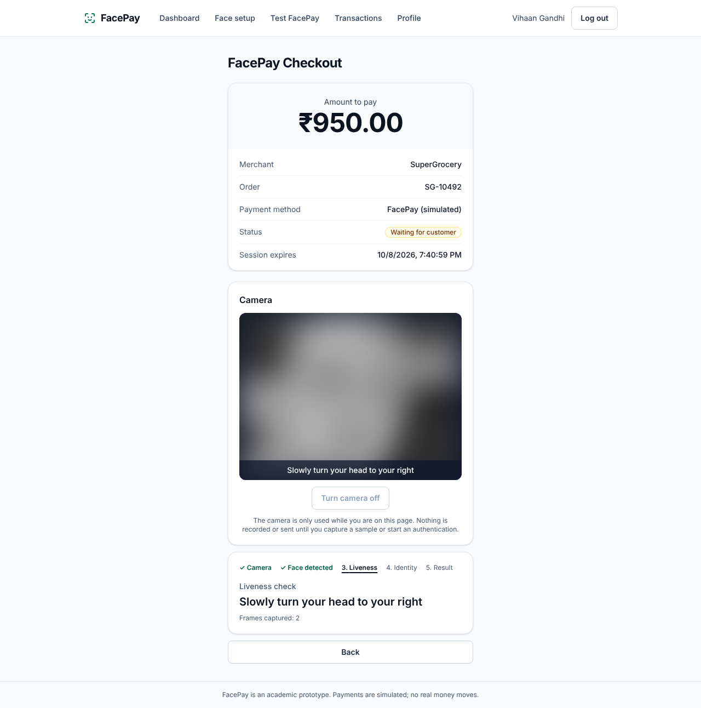
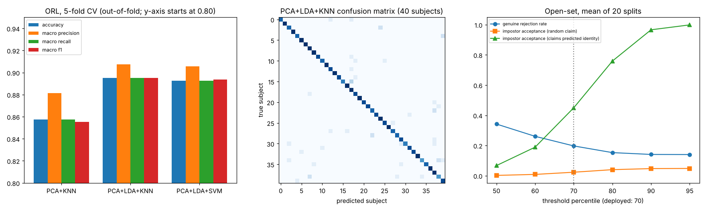

# FacePay

**PCA-LDA Based Facial Authentication Framework for Secure Digital Payment Simulation**

FacePay is an academic prototype. A merchant creates a payment request, a customer opens the checkout link, shows their
face to the camera, follows one short head-movement instruction, and, if the system accepts them, confirms a **simulated**
payment. There is no UPI, bank, wallet or real money anywhere in it; a "transaction" is a row in PostgreSQL.

Face recognition is classical on purpose: images go through **PCA, then LDA, then a KNN or linear-SVM classifier**
(no pretrained embeddings). Around it sit a challenge-response liveness check, an explicit authentication policy,
single-use server-side payment authorizations and encrypted storage of face data.

> **Not production-ready, and not secure enough for real payments or real biometric data.** The measured limits
> (a stranger who resembles the account holder is accepted about 45% of the time; a photo slid sideways passes the liveness
> check) are in [Known limitations](#known-limitations). Nothing here is bank-grade, fraud-proof or validated on real webcams.



## Architecture

```
React + Vite + Tailwind (Vercel-ready)  ──►  FastAPI  ──►  PostgreSQL
                                              └─ ML pipeline: Haar detector → PCA → LDA → KNN/SVM → liveness → policy
```

| Part | Where |
|---|---|
| Frontend | `frontend/` (React, Vite, Tailwind v4, Recharts, Vitest) |
| Backend, ML pipeline | `backend/` (FastAPI, SQLAlchemy 2, Alembic; pipeline in `backend/app/ml`) |
| Offline experiments and results | `ml/experiments/`, `ml/results/` |
| Documentation | `docs/` and `docs/final/` |

## Setup

Requirements: Python 3.13, Node 20+, PostgreSQL 14+.

```sql
CREATE USER facepay WITH PASSWORD '<your-password>';
CREATE DATABASE facepay OWNER facepay;
CREATE DATABASE facepay_test OWNER facepay;   -- tests reset this schema; the name must end in _test
```

```bash
# backend
cd backend
python3 -m venv .venv && . .venv/bin/activate
pip install -r requirements-lock.txt          # tested set; requirements.txt has the loose version ranges
cp .env.example .env                           # then edit the values below
python -c "from app.core.crypto import generate_key; print(generate_key())"   # use as BIOMETRIC_KEY
alembic upgrade head
uvicorn app.main:app --reload --port 8000      # API docs at http://localhost:8000/docs (development only)

# frontend
cd frontend
npm install
cp .env.example .env.local
npm run dev                                    # http://localhost:5173
```

To try face payments you need **two** enrolled customers (the shared model needs at least two people), and each customer
needs the configured minimum of samples across several poses. A merchant account creates the payment.

### Environment variables

| Variable | Where | Purpose |
|---|---|---|
| `DATABASE_URL` | backend | PostgreSQL URL (`postgresql+psycopg://…`; `postgres://` and `postgresql://` are accepted too) |
| `JWT_SECRET` | backend | Signing secret, at least 16 characters (use 48+ random characters in production) |
| `BIOMETRIC_KEY` | backend | AES-256 key (32 random bytes, base64) for stored face data. Required when `APP_ENV=production`. Back it up: losing it makes all face data unreadable |
| `CORS_ORIGINS` | backend | Exact frontend origin(s), comma separated |
| `APP_ENV` | backend | `production` enables the startup checks and turns off `/docs` |
| `*_RATE_LIMIT_PER_MINUTE`, `JWT_*` | backend | Rate limits and token settings (defaults in `.env.example`) |
| `TEST_DATABASE_URL` | backend, tests only | Must name a database ending in `_test` |
| `VITE_API_BASE_URL` | frontend | Backend URL, compiled into the bundle |

`.env` files are git-ignored; only `.env.example` files are committed. No secret is in the repository.

## Testing

```bash
cd backend && python -m pytest -q                        # 341 tests, real PostgreSQL
cd backend && ruff check app tests alembic --select F,E9,B --ignore E501,B008 && alembic check
cd frontend && npm test && npm run lint && npm run build  # 168 tests; oxlint; production build
```

Last full run (Phase 7): backend 341 passed, frontend 168 passed, lint and Ruff clean, Alembic reports no drift, production
build succeeds. A real-browser run (Playwright, headless Chromium, production build, real API and database) passed 44 of 44
steps with axe-core reporting no violations on 10 pages. **Its camera is simulated** with ORL photos; no physical webcam
was used, and automated accessibility checks do not establish WCAG conformance. See [`docs/browser-testing/`](docs/browser-testing/README.md).

## ML evaluation (public ORL dataset, not webcam data)

5-fold cross-validation, all scores out-of-fold, 40 subjects × 10 images:

| Pipeline | Accuracy | Macro precision | Macro recall | Macro F1 |
|---|--:|--:|--:|--:|
| PCA + KNN | 0.858 | 0.881 | 0.858 | 0.855 |
| PCA + LDA + KNN | 0.895 | 0.908 | 0.895 | 0.895 |
| PCA + LDA + SVM | 0.892 | 0.906 | 0.892 | 0.894 |

4,096 pixels → 148 PCA components (95% of the variance) → 39 LDA components. LDA gives a consistent gain over PCA alone; KNN
and SVM are equivalent. At the deployed distance threshold, 19.7% of genuine probes are rejected, a random-identity impostor
is accepted 2.3% of the time, and an impostor classified as the claimed user is accepted 45% of the time.
Full tables, confusion matrices, liveness measurements, local latency and the exact conditions:
[`docs/final/evaluation-results.md`](docs/final/evaluation-results.md). Reproduction (the ORL images are **not** included;
how to obtain them is described there): [`docs/final/reproducibility.md`](docs/final/reproducibility.md).



## Deployment

The frontend has a Vercel configuration, the backend a Dockerfile and a pinned dependency lock, and the database is any
PostgreSQL. **It has not been deployed**: no backend or database host was available, and a frontend alone would not work.
[`docs/final/deployment-guide.md`](docs/final/deployment-guide.md) lists the steps, variables and a smoke-test checklist, and
marks what was and was not verified (the Docker image has not been built).

## Known limitations

* Results are from the ORL benchmark only; real webcams, lighting and users were not evaluated.
* The recogniser is a closed-set classifier and a weak verifier (see the 45% figure above); about one genuine attempt in five is rejected.
* Liveness is a basic head-movement challenge. A photo slid sideways passes (simulated test), and video replay, masks and deepfakes were not tested. It is not a presentation-attack-detection system.
* One shared model for everyone, trained on demand; per-process rate limits and caches (run one backend instance).
* Tokens are kept in `localStorage`; no refresh tokens, revocation, email verification, password reset or Content-Security-Policy.
* One encryption key, no rotation. No consent records or retention policy.
* No refunds, balances, payouts or idempotency keys.

## Documentation

| Document | Contents |
|---|---|
| [`docs/final/project-report.md`](docs/final/project-report.md) | Full academic report |
| [`docs/final/evaluation-results.md`](docs/final/evaluation-results.md) | All measured results and their conditions |
| [`docs/final/reproducibility.md`](docs/final/reproducibility.md) | Environment, dataset, seeds, commands |
| [`docs/final/security-assessment.md`](docs/final/security-assessment.md) | Threats, mitigations, residual risks |
| [`docs/final/deployment-guide.md`](docs/final/deployment-guide.md) | Deployment preparation and checks |
| [`docs/final/demo-script.md`](docs/final/demo-script.md) | Eight-minute demo walkthrough |
| [`docs/ml-architecture.md`](docs/ml-architecture.md), [`docs/ml-feasibility.md`](docs/ml-feasibility.md) | Pipeline design and feasibility experiments |
| [`docs/face-authentication.md`](docs/face-authentication.md), [`docs/payments.md`](docs/payments.md), [`docs/auth.md`](docs/auth.md) | Authentication policy, payment flow, accounts |
| [`docs/security-review.md`](docs/security-review.md) | Phase 6 security review |
| [`docs/architecture.md`](docs/architecture.md) | Architecture and schema notes |
| [`docs/browser-testing/`](docs/browser-testing/README.md) | Real-browser test script and results |
| [`ml/results/README.md`](ml/results/README.md) | Phase 3 to 5 experiment write-up |
| `docs/final/screenshots/` | Interface screenshots (camera previews blurred) |

## Project history

Built in seven phases: foundation, accounts, PCA/LDA pipeline, face authentication with liveness, simulated payments,
product polish and security review, and final evaluation and documentation. The git history has one commit per phase.

## License / data

No licence file is included; all rights remain with the authors unless they state otherwise. The ORL face database belongs to
its distributors and is not redistributed; see `docs/final/reproducibility.md`.
